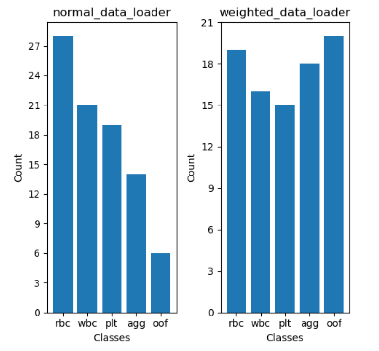
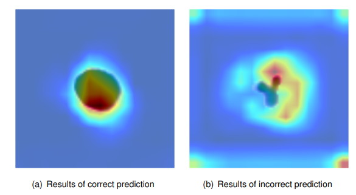
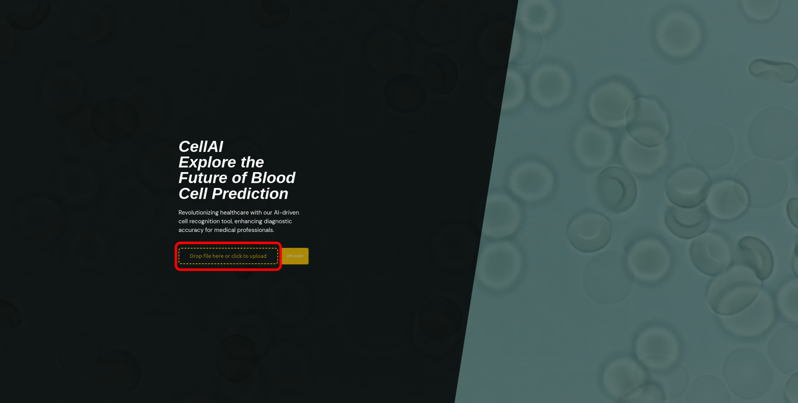
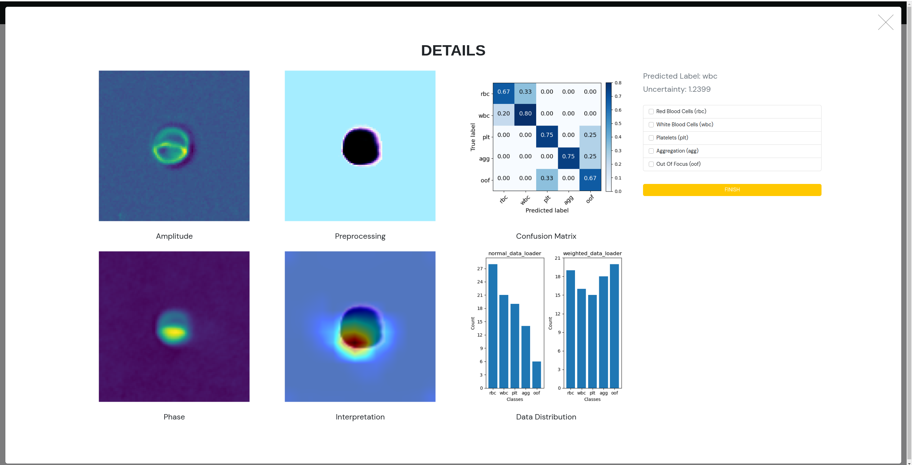
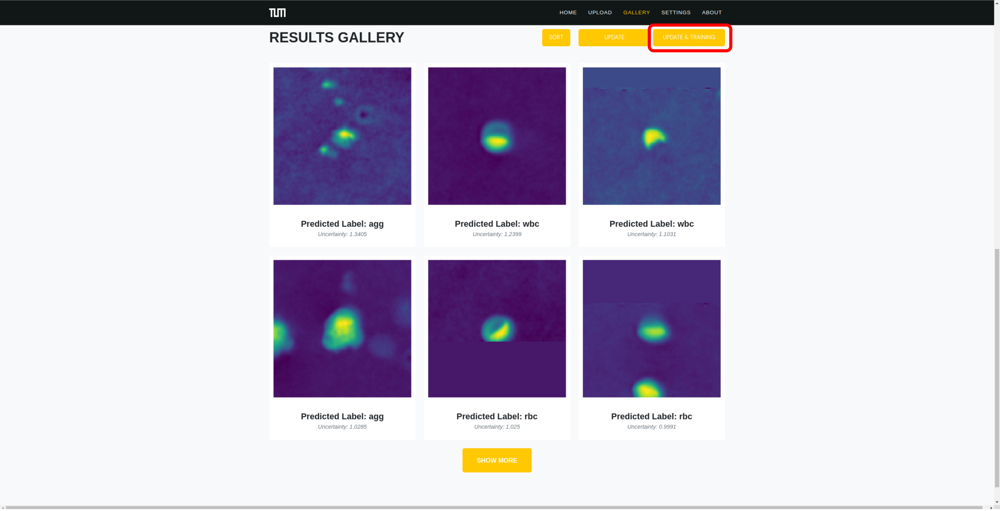

# Applied Machine Intelligence Project

It is the repository of the final project for Applied Machine Intelligence (SS23) at Technical University Munich.

## Introduction
This project aims to help clinicians to identify blood cell types. The main functions are segmentation, classification and active learning.

## Folder Structure

```bash
.
├── ami
│   ├── asgi.py
│   ├── __init__.py
│   ├── settings.py
│   ├── urls.py
│   └── wsgi.py
├── assets
├── db.sqlite3
├── home
│   ├── admin.py
│   ├── apps.py
│   ├── __init__.py
│   ├── migrations
│   ├── models.py
│   ├── tests.py
│   ├── utils.py
│   └── views.py
├── main_page
│   ├── admin.py
│   ├── apps.py
│   ├── change_label.py
│   ├── __init__.py
│   ├── migrations
│   ├── models.py
│   ├── plot_prediction.py
│   ├── tests.py
│   └── views.py
├── manage.py
├── model
│   ├── inputs
│   │   ├── a_learning
│   │   ├── prediction
│   │   └── training
│   ├── main.py
│   ├── outputs
│   │   ├── checkpoints
│   │   └── logs
│   ├── settings
│   │   └── settings.npy
│   └── src
│       ├── dataset.py
│       ├── model.py
│       ├── optimizer.py
│       └── utils
├── README.md
├── requirements.txt
├── static
│   ├── home
│   │   ├── assets
│   │   ├── css
│   │   └── js
│   ├── main_page
│   │   ├── assets
│   │   ├── css
│   │   └── js
│   └── plots
└── templates
    ├── home
    │   ├── index.html
    │   ├── prediction.html
    │   └── training.html
    └── main_page
        ├── about.html
        ├── main_page.html
        ├── mp_base.html
        └── settings.html
```

## Requirements

This project requires Python 3.9 or higher and uses the following Python packages:

- pytorch
- torchvision
- scikit-learn
- numpy
- matplotlib
- django
- openCV
- tqdm
- h5py

## Installation

To install the necessary packages, use pip:

```bash
pip install -r requirements.txt
```

## My contribution

The code was integrated by team members using only copy and paste, so the commit's for the whole project are incomplete. So I will next introduce my contribution in this project.

### Solving the problem of unbalanced data

For the blood cell classification task, the dataset is highly unbalanced. For instance, the number of red blood cells may significantly outnumber other cell types, resulting in a significant imbalance in the sample distribution among different classes.

This class imbalance problem can have negative impacts on machine learning algorithms, as the model may tend to predict unknown samples as belonging to the majority class, thereby neglecting or misclassifying the minority class. To address this issue, I have taken an effective approach by introducing a [sampler](https://github.com/Tate-Wei/CellAI/blob/121ebd1cfbc9a83f7b342594a1b443d8be1343d8/model/src/optimizer.py#L86C47-L86C47) in the dataloader to balance the number of samples for each class in the training data.




### Cell Classification based on Vgg16

VGG16 is a classic CNN consisting of multiple convolutional and fully connected layers, allowing it to better capture complex features in images. To enhance the model’s performance and speed up the training process, I use weights pre-trained on the ImageNet1K dataset for [VGG16](./model/src/model.py).

Through transfer learning, these pre-trained parameters are used as initial weights and then I finetune the model on the blood cell detection task. Specifically, I fix the majority of VGG16’s weights and replace the final layer with a fully connected layer for the target class with 5 categories.

### Active learning

Due to the size limitation of labeled dataset, active learning is integrated in our model to enhance the efficiency and accuracy of our cell classification system. the most informative datapoints are determined via uncertainty sampling, enabling the user to give feedback and refine the model. To compute the prediction uncertainty of each sample, I utilize the [Monte Carlo Dropout](https://github.com/Tate-Wei/CellAI/blob/121ebd1cfbc9a83f7b342594a1b443d8be1343d8/model/src/optimizer.py#L213) method, which could approximate Bayesian inference in deep learning models.

### Grad-CAM

To enhance the interpretability of the model, I employ [Grad-CAM](./model/src/utils/grad_cam.py)(Gradient-weighted Class Activation Mapping), a technique which uses the gradient information flowing into the last convolutional layer of the model to produce a coarse localization map highlighting the important regions in the image for predicting the target class. The Grad-CAM visualization is shown below.



### TODO List

- [x] Add requirements.txt
- [ ] Allow jpg/png images as input
- [ ] Add more models
- [ ] Build dockerfile
- [ ] Deploy the website on AWS

## Local Version

To run the Django server, switch to /CellAI, use the following command:
```bash
python manage.py runserver
```
Then open a web browser and navigate to http://127.0.0.1:8000/ to see the website in action.


In the homepage, upload a h5py file and wait for the prediction.



In the results gallery, click an image and modify the prediction label. Click `UPDATE & TRAINING` to retrain the model and predict.




